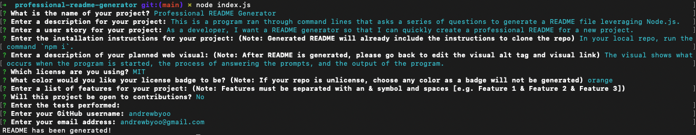

# Professional README Generator
[](./LICENSE)
## Description
This is a program ran through command lines that asks a series of questions to generate a README file leveraging Node.js.

## User Story
```
As a developer, I want a README generator so that I can quickly create a professional README for a new project.
```

## Table of Contents
- [Installation](#installation)
- [Usage](#usage)
- [License](#license)
- [Questions](#questions)

## Installation
To get the app on your local machine:
Click on the code button on the repo.
Copy the HTTPS or SSH link.
Run the command `git clone` with the copied HTTPS or SSH link.
In your local repo, run the command `npm i`.

## Usage
The visual shows what occurs when the program is started, the process of answering the prompts, and the output of the program.



## License
This application is covered under the MIT license.

## Questions
To view more of my projects, you can visit my GitHub page at [andrewbyoo](https://github.com/andrewbyoo).
If you have questions, email me at [andrewbyoo@gmail.com](mailto:andrewbyoo@gmail.com).
